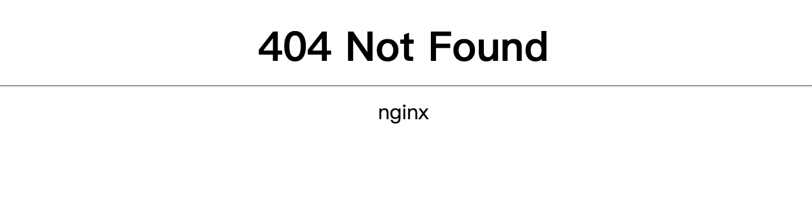
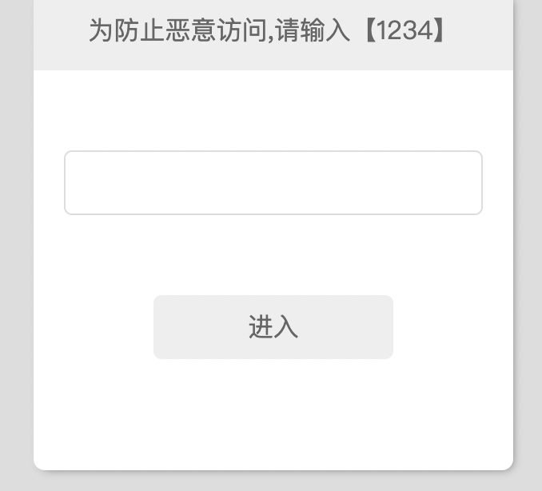
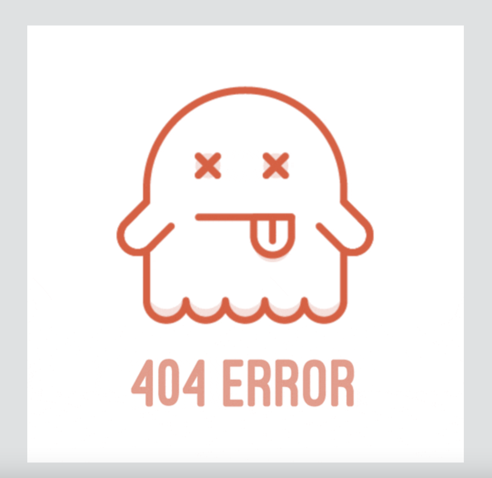

# 01bz-PC-Bypass
用于绕过第一版主电脑端检测的油猴（Tampermonkey）脚本

## 使用方法

直接通过油猴导入。由于网址可能会有变，需要看情况自行修改@match字段。

## 检测机制分析

使用电脑端的浏览器打开网站的时候，会加载 **/js/wap8.js** ，用于检测UA，如果不是手机或平板端的UA，则会在网页中显示404 Not Found，并隐藏其他元素：



```javascript
$(function() {
    var _mobile = 0;
    UA = navigator.userAgent.toLowerCase();
    url = window.location;
    url = url.toString();
    if ((UA.indexOf('iphone') != -1 || UA.indexOf('mobile') != -1 || UA.indexOf('android') != -1 || UA.indexOf('ipad') != -1 || UA.indexOf('windows ce') != -1 || UA.indexOf('ipod') != -1) && UA.indexOf('ipod') == -1) {
        _mobile = 1;
        $(function() {
            $("#gundong").hide()
        });
    }
    if (_mobile != 1) {
        if ($('#tip').length > 0) {
            $('body').css({
                'background': '#fff'
            });
            $('div,input,form').hide();
            $('div#tip').append('<center><h1>404 Not Found</h1></center><hr><center>nginx</center>').show();
        }
    }
})
```

因此，只需要逆向这个这个过程，即取消元素的隐藏，然后隐藏这个404元素。如果是初次访问，会看到要求输入1234防止恶意访问。



进入网站后，还是会看到一个404 ERROR的图片，这是因为网站还会加载一个 **/js/pc.js** 文件，检测navigator.platform、navigator.userAgent以及地址，如果platform包含“win”或“mac”、URL不包含“?debug”、userAgent不包含“eganbro”这三个条件同时满足，则会加载这个404图片。



```javascript
var ua = navigator.platform.toLowerCase().match(/(win|mac)/i) ? 1 : 0,
    eg = navigator.userAgent.toLowerCase().match(/eganbro/i) ? 1 : 0,
    targetURL = "https://www.baidu.com/";
$("#targetPC").attr("href", targetURL);
if (1 == ua && 0 > document.location.href.indexOf("?debug") && 0 == eg) {
    var checkDevToolsOpened = function() {
        if (~navigator.userAgent.indexOf("Firefox")) {
            var a = /./;
            a.toString = function() {
                this.opened = !0
            };
            console.log(a);
            console.clear && console.clear();
            a.opened && clickTarget()
        } else a = function() {}, a.toString = function() {
            clickTarget();
            return "-"
        }, console.profile(a), console.profileEnd(a), console.clear && console.clear()
    }, clickTarget = function() {
            init || (init = !0, $("#targetPC").click())
        }, init = !1;
    checkDevToolsOpened();
    setInterval(checkDevToolsOpened, 1E3);
    $(document).mousemove(clickTarget);
    $(document).keydown(clickTarget);
    $(document).bind("contextmenu", function() {
        return !1
    });
    var b = document.compatMode && "CSS1Compat" == document.compatMode ? document.documentElement : document.body,
        op = document.createElement("div");
    op.style.position = "fixed";
    op.style.top = 0;
    op.style.left = 0;
    op.style.background = '#DEE1E2 url("https://area51.mitecdn.com/loader.gif") no-repeat center 200px';
    op.style.width = "100%";
    op.style.height = b.clientHeight + "px";
    op.style.zIndex = 99999;
    var first = document.body.firstChild;
    document.body.insertBefore(op, first)
};
```

此时，只需要使这三个条件中的任意一个不满足即可绕过检测，例如修改UA或者在URL后面添加“?debug”。但是UA似乎没法直接通过JS修改，而修改URL会再次发起请求，也不太好。所以我的方法是直接把这个图片（body里的第一个元素）删掉，这样就能看到原本的网页了。
